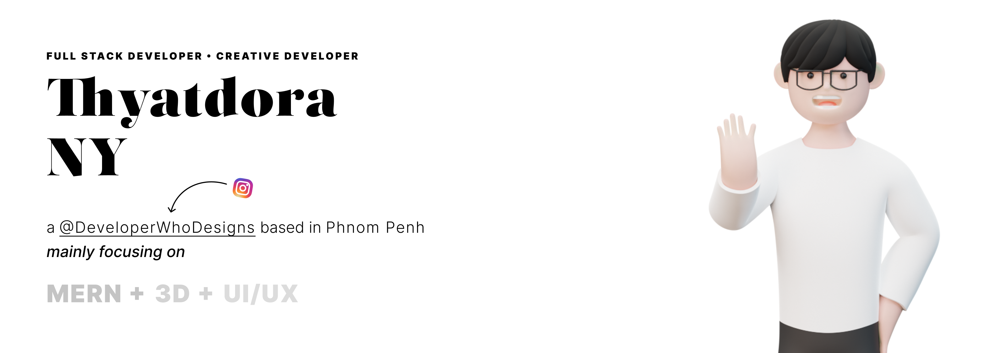

 

<h4>
  <code>
    About Me 👋
  </code>
</h4>

My name is **Dora**. I am a full-stack developer who is **heavy empathizes**
with developing and designing **_the best experience for users_**.

Years since I have started to program, I have been transiting from **C** to
**C++** to **C#** then **Java**, and now **JavaScript**, it is one of the most
technology that I really enjoy working with. Shortly after I got introduced to
**React**, and **React Native**, I am so in love with these technologies so much
that I decided to be stick with them.

 

<h4>
  <code>
    🚀 Technologies
  </code>
</h4>

<h5>
  <code>
   👽 Languages
  </code>
</h5>

<h5>
  <code>
	 💅 Frontend
  </code>
</h5>

<h5>
  <code>
    🧠 Backend
  </code>
</h5>

<h5>
  <code>
    ⭐️ Others
  </code>
</h5>

 

<h4>
  <code>
    Find Me On 🥷
  </code>
</h4>

- LinkedIn <a href="https://www.linkedin.com/in/nythyatdora">Thyatdora Ny</a>
- Twitter <a href="https://www.twitter.com/nythyatdora">@nythyatdora</a>
- Instagram
  <a href="https://www.instagram.com/user/developerwhodesigns">@DeveloperWhoDesigns</a>
